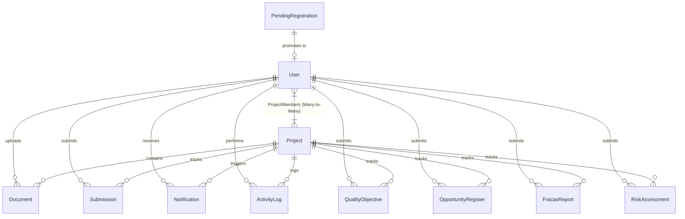

# SQRMT — Mock Interview Q&A

> **Candidate:** Utsav Bhardwaj  
> **Project:** SQRMT (SSPL Quality Reliability Monitoring and Tracking) — DRDO SSPL  
> **Stack:** Next.js · Node.js/Express · Prisma ORM · PostgreSQL (Neon) · JWT · bcrypt  

---

## Question 1 of 8 — Problem Statement & Motivation

**Interviewer:** Tell me the real-world problem this project solves. What was broken before you built it, and who was suffering?

### Answer

So the context here is DRDO's Solid State Physics Laboratory, or SSPL, which is a defense research lab that runs roughly **25 active R&D projects** spread across **10 departments** at any given time. Each project involves multi-stage quality audits — things like FRACAS failure reports (which stands for Failure Reporting, Analysis, and Corrective Action System — it's a standard methodology used in defense and aerospace for tracking equipment and component failures), risk assessments where you calculate likelihood-times-impact matrices, opportunity registers for improvement tracking, and monthly progress submissions from each project manager.

Before I built SQRMT, this entire lifecycle was running on **paper forms, Excel sheets, and email threads**. There was no centralized system — every department was essentially an island.

The core pain points were:

1. **Decentralized tracking:** Each Project Manager (PM) maintained their own spreadsheets on their local machines. There was absolutely no single source of truth for the Lab Director to get a bird's-eye view of which projects were on track, which had overdue quality reports, or which had pending failure analyses. If the Director wanted to know the status of Project X, they had to call or email the PM and wait — sometimes for days — for a response.

2. **Manual follow-ups:** The Director had to physically walk between departments or send individual emails chasing each PM for status updates. Think about that — 25 projects, 10 departments, and one person manually following up with each one. There was no notification mechanism, no ping system, no automated reminders — just human memory and persistence. Things would inevitably fall through the cracks.

3. **No audit trail:** This is the critical one for a defense organization. DRDO audits require a clear, tamper-proof chain of custody — who submitted a report, when exactly it was submitted, and what remarks the reviewing authority (the Director) added during review. Paper processes made this nearly impossible to reconstruct during external audits. If an auditor asks "who approved this FRACAS report and when?", you'd be flipping through filing cabinets trying to find a signature on a form.

4. **Document chaos:** Audit-critical documents — PDFs, scanned failure reports, quality certificates — were scattered across email attachments, USB drives, and individual desktops, with no versioning, no central repository, and no way to tie a specific document to a specific project. If a PM left the organization or changed machines, those documents could effectively be lost.

**SQRMT digitized this entire workflow** into a role-based web application. The Admin (which maps to the Lab Director or reviewing authority) gets a real-time dashboard showing all 25 projects at once — their statuses, assigned members, uploaded documents, and pending quality entries. The Director can now "ping" a specific project manager directly from the dashboard to request an update, and the system sends them an email notification automatically. Every single action in the system — every document upload, every progress submission, every quality entry creation — is logged in an immutable `ActivityLog` table with timestamps, user IDs, and project IDs. This means during an external audit, you can pull up a complete, chronological history of who did what and when.

For Members (Project Managers), they only see and interact with the projects they are explicitly assigned to. A PM in the optics department cannot see projects from the semiconductor department — this boundary is enforced at both the API layer (through Prisma query scoping) and the frontend (through conditional rendering). The system doesn't just hide the UI — even if someone tries to access another project's data through a direct API call, the server will reject it.

---

## Question 2 of 8 — JWT-Based RBAC Implementation

**Interviewer:** You mentioned JWT-based RBAC on your resume. Walk me through exactly how you implemented it — what roles existed in the system, what each role could and couldn't do, and how the server enforced those restrictions on each request.

### Answer

Sure. So let me start from the fundamentals and then walk you through exactly how it works in SQRMT.

**RBAC**, or Role-Based Access Control, is an authorization model where permissions aren't assigned to individual users directly — instead, you define **roles** (like Admin, Editor, Viewer), and each role carries a set of permissions. Users are then assigned a role, and they inherit all the permissions that come with it. The benefit of this over per-user permissions is scalability — if you have 50 project managers, you don't set permissions individually for each one; you just assign them the "Member" role and the system knows what they can and can't do.

**JWT**, or JSON Web Token, is the mechanism I used to implement **stateless authentication**. The key idea is that after a user logs in, the server generates a cryptographically signed token containing the user's identity. This token is sent back to the client and attached to every subsequent request. The server can verify the token's authenticity without maintaining any server-side session state — no session files, no Redis store, no database lookup for session data. The token itself is the proof of identity. This makes the architecture horizontally scalable — you can run multiple Express server instances behind a load balancer and any instance can verify any token, because the verification only requires the shared secret key, not any shared state.

#### The Two Roles

The system has exactly **two roles**, stored as a plain string field on the `User` model in the Prisma schema:

| Role       | Who They Are                                                  |
|------------|---------------------------------------------------------------|
| **Admin**  | The Lab Director / reviewing authority — has full system access |
| **Member** | Project Managers assigned to specific projects — scoped access  |

I deliberately kept the role system simple — just two roles with a string field — rather than building a complex permission table with bitwise flags or a separate `Role` model with many-to-many relationships. For DRDO's use case, the access pattern is very clear-cut: either you're the authority who oversees everything, or you're a project manager who works within your assigned scope. There's no intermediate role like "Department Head" or "Viewer" — those weren't needed for the MVP, though the string-based approach makes it easy to add more roles later without a schema migration (you'd just add new checks in the middleware and controllers).

The role is set at registration time — it defaults to `'Member'` if not specified — and persists in the PostgreSQL `User` table. There's also a `seed.js` script that runs every time the server boots and guarantees at least one Admin account exists in the database. This is a safety mechanism — if the database is ever wiped or freshly migrated, the system isn't locked out because there's always a bootstrapped admin who can create other users.

---

#### How the JWT Is Created

When a user logs in successfully via `POST /api/auth/login`, the authentication flow goes through three distinct steps. First, the controller looks up the user by email using Prisma's `findUnique` method, which translates to a `SELECT * FROM "User" WHERE email = ?` under the hood. If no user is found, the login fails immediately.

Second, it compares the submitted plaintext password against the stored hash using `bcrypt.compare()`. This is important to understand — we **never** store plaintext passwords in the database. During registration, the password goes through **bcrypt hashing with a 10-round salt**. What bcrypt does is it takes the password, generates a random salt (a random string that makes the hash unique even if two users have the same password), and runs it through a computationally expensive hashing algorithm 2^10 = 1,024 times. The result is a one-way hash that can't be reversed back to the original password. During login, `bcrypt.compare()` takes the submitted password, applies the same salt (which is embedded in the stored hash), runs the same hashing process, and checks if the output matches. This means even if an attacker gets access to the database, they can't read anyone's password — they'd have to brute-force each hash individually, which is computationally infeasible with bcrypt.

Third, if the password matches, the server signs a JWT:

```javascript
const generateToken = (id) => {
  return jwt.sign({ id }, process.env.JWT_SECRET, { expiresIn: '30d' });
};
```

Now here's a very important design decision that I'd want to highlight. The JWT payload contains **only the user's UUID** — `{ id }`. I deliberately chose **not** to embed the role in the token. Many tutorials and examples online will put the role right in the JWT payload, like `{ id, role: 'Admin' }`, and then read the role from the token on every request. The problem with that approach is **staleness**. A JWT is valid for 30 days in my system. If the director decides to demote a user from Admin to Member (or if an account gets compromised and you need to revoke privileges), a role baked into the token won't reflect that change — the user would continue operating with Admin privileges for up to 30 days until the token expires. By storing only the ID in the token and looking up the role fresh from the database on every request, any role change takes effect **immediately** on the very next API call. The tradeoff is one extra database read per request, but for a system handling DRDO audit data, security takes priority over that marginal latency.

The token is signed using the `JWT_SECRET` from environment variables — this is a cryptographic HMAC-SHA256 signature. If anyone tampers with the token payload (say, changing the `id` field to impersonate another user), the signature verification will fail because the signature was computed using the original payload and the secret key. Without knowing the secret key, an attacker cannot forge a valid signature. The token has a **30-day expiry** (`expiresIn: '30d'`), which means after 30 days the user is automatically logged out and must re-authenticate — this limits the window of exposure if a token is ever leaked.

---

#### How the Server Enforces Access — The Two Middleware Functions

All route protection flows through two Express middleware functions in `authMiddleware.js`:

##### 1. `protect` — Authentication Middleware

```javascript
const protect = async (req, res, next) => {
  let token;
  if (req.headers.authorization && req.headers.authorization.startsWith('Bearer')) {
    token = req.headers.authorization.split(' ')[1];
    const decoded = jwt.verify(token, process.env.JWT_SECRET);

    const user = await prisma.user.findUnique({ where: { id: decoded.id } });
    if (user) {
      delete user.password;   // strip password hash before attaching
      req.user = user;        // attach full user object to request
    }
    next();
  }
  if (!token) {
    res.status(401).json({ message: 'Not authorized, no token' });
  }
};
```

**What it does, step by step:**
- Extracts the token from the `Authorization: Bearer <token>` header.
- Calls `jwt.verify()` to cryptographically validate the signature and check expiry. If the token is tampered with or expired, this throws and we return **401**.
- Uses the decoded `id` to **fetch the full user record from the database** — this is where we get the fresh `role` value.
- Strips the password hash from the user object (`delete user.password`) before attaching it to `req.user`, so downstream controllers never accidentally leak it.
- Calls `next()` to pass control to the next middleware or route handler.

##### 2. `admin` — Authorization Middleware

```javascript
const admin = (req, res, next) => {
  if (req.user && req.user.role === 'Admin') {
    next();
  } else {
    res.status(403).json({ message: 'Not authorized as an admin' });
  }
};
```

**What it does:** A simple role gate. It reads `req.user.role` (set by `protect`) and returns **403 Forbidden** if the role isn't `Admin`. This always runs *after* `protect` in the middleware chain.

---

#### How Roles Map to Route Permissions

Here's the full permission matrix showing which middleware guards which routes:

| Resource / Action                        | Middleware Chain        | Admin | Member |
|------------------------------------------|------------------------|:-----:|:------:|
| **Login / Register / Verify Email**      | *(none — public)*      | ✅    | ✅     |
| **View Projects** (`GET /api/projects`)  | `protect`              | All projects | Only assigned projects |
| **Create Project**                       | `protect → admin`      | ✅    | ❌ 403 |
| **Update / Delete Project**              | `protect → admin`      | ✅    | ❌ 403 |
| **Add / Remove Project Members**         | `protect → admin`      | ✅    | ❌ 403 |
| **Ping Manager**                         | `protect → admin`      | ✅    | ❌ 403 |
| **Upload Documents**                     | `protect → admin`      | ✅    | ❌ 403 |
| **View Documents**                       | `protect`              | ✅    | ✅ (project-scoped) |
| **Submit Progress**                      | `protect`              | ✅    | ✅ (own submissions) |
| **Create Quality Entries** (QO, FRACAS, Risk, etc.) | `protect`   | ✅    | ✅ (if assigned to project) |
| **Update Quality Entries**               | `protect`              | ✅ (all + adminRemarks) | Own entries only, no adminRemarks |
| **Delete Quality Entries**               | `protect → admin`      | ✅    | ❌ 403 |
| **List / Delete Users**                  | `protect → admin`      | ✅    | ❌ 403 |

---

#### The Third Layer — Controller-Level Authorization

Beyond the two middleware functions, there's a **third, finer-grained authorization layer** inside the controllers themselves. This handles cases where both Admin and Member can hit the same endpoint, but with different scopes:

##### a) Project Scoping (projectController.js)

```javascript
// GET /api/projects
if (req.user.role === 'Admin') {
  projects = await prisma.project.findMany({ ... });       // ALL projects
} else {
  projects = await prisma.project.findMany({
    where: { assignedMembers: { some: { id: req.user._id } } }, // Only assigned
  });
}
```

Admin sees every project. Members only see projects where their user ID exists in the `_ProjectMembers` join table — enforced at the Prisma query level, not just the UI.

##### b) Quality Entry Ownership (qualityController.js)

For update operations on Quality Objectives, FRACAS Reports, Opportunity Registers, and Risk Assessments:

```javascript
if (req.user.role === 'Member') {
  const existing = await prisma.qualityObjective.findUnique({ where: { id } });
  if (!existing || existing.submittedById !== req.user._id)
    return res.status(403).json({ message: 'Cannot edit this entry' });
  delete req.body.adminRemarks;  // Members cannot set admin remarks
}
```

Three things happen here:
1. **Ownership check** — a Member can only update entries they originally submitted (`submittedById === req.user._id`).
2. **Field-level restriction** — even on their own entries, the `adminRemarks` field is stripped from the request body via `delete req.body.adminRemarks`. Only Admins can write review comments.
3. **Project assignment check** — on create operations, the helper `isMemberAssigned()` verifies the member is actually assigned to the target project before allowing them to submit a quality entry.

##### c) Admin Self-Protection (authController.js)

```javascript
if (user.role === 'Admin')
  return res.status(403).json({ message: 'Cannot delete an admin account' });
```

Even an Admin cannot delete another Admin's account through the API — this prevents accidental lockout.

---

#### Summary — The Three Concentric Rings of Security

To summarize the whole approach concisely:

```
┌─────────────────────────────────────────────────┐
│  Ring 1: protect middleware                      │
│  → Is the JWT valid & unexpired?                 │
│  → Does the user still exist in the DB?          │
│  → If no → 401 Unauthorized                      │
│                                                   │
│  ┌─────────────────────────────────────────────┐ │
│  │  Ring 2: admin middleware                    │ │
│  │  → Is req.user.role === 'Admin'?             │ │
│  │  → If no → 403 Forbidden                     │ │
│  │                                               │ │
│  │  ┌─────────────────────────────────────────┐ │ │
│  │  │  Ring 3: Controller-level logic          │ │ │
│  │  │  → Project scoping (assigned only)       │ │ │
│  │  │  → Ownership checks (submittedById)      │ │ │
│  │  │  → Field stripping (adminRemarks)        │ │ │
│  │  └─────────────────────────────────────────┘ │ │
│  └─────────────────────────────────────────────┘ │
└─────────────────────────────────────────────────┘
```

This **defense-in-depth** approach ensures that even if someone bypasses the frontend (e.g., using Postman or curl), the server independently validates identity, role, project assignment, and resource ownership before performing any operation.

---

## Question 3 of 8 — N+1 Query Optimization (~96% DB Call Reduction)

**Interviewer:** You mentioned on your resume that SQRMT reduced DB calls by ~96% by solving N+1 query issues. Walk me through a specific example — where exactly was the N+1 happening, what query was being fired, and what did you change to fix it?

### Answer

#### First, What Exactly Is an N+1 Query Problem?

Before I walk through the specific example, let me explain the N+1 problem in plain terms because this is one of the most common performance pitfalls in any application that uses an ORM or interacts with a relational database.

Imagine you're building a page that shows a list of 25 projects, and for each project you also want to display the names of the team members assigned to it. The naive approach — and the one I originally had — is to first fetch all 25 projects in one query, and then for **each** project, fire a **separate** query to fetch its assigned members. That gives you 1 query for the project list + 25 individual queries for members = **26 queries total**. That's the "N+1" — one initial query plus N follow-up queries, where N is the number of results from the first query.

The problem scales horribly. If you have 25 projects, it's 26 queries. If you have 100 projects, it's 101 queries. Each query involves a full round trip from your Node.js application to the PostgreSQL database — DNS resolution, TCP handshake, query parsing, execution, and data serialization back. Even if each individual query takes only 5-10 milliseconds, at 100 queries that's already half a second to a full second of latency just for one API call. In a government application like DRDO where the director is loading a dashboard with all projects, all members, and all their submissions — that kind of delay is unacceptable and would compound as data grows.

The fix is conceptually simple: instead of fetching related data in a loop, you tell the database to fetch everything you need **in one shot** using a JOIN. In ORM terms, this is called **eager loading** — you tell Prisma upfront "when you fetch projects, also include the assigned members in the same query." Prisma translates that into a SQL `LEFT JOIN` or a secondary `IN` query, and the database handles everything in one or two round trips instead of 26.

---

#### The Specific Scenario: Admin Dashboard — Project List with Members

The most impactful N+1 problem in SQRMT was on the **Admin Dashboard**. When the director logs in, the frontend calls `GET /api/projects`, and the backend needs to return every project along with the names and emails of all assigned members for each project.

**The naive (broken) approach** that I originally had would have looked something like this conceptually: first, fetch all projects from the `Project` table. Then, for each project, go back to the database and query the `_ProjectMembers` join table to find which users are assigned, and then fetch those user records. If there are 25 projects, that's 1 query to get the project list, then 25 more queries to resolve the many-to-many relationship for each project — **26 queries total**.

**The fixed approach** uses Prisma's `include` directive to tell the ORM: "When you fetch projects, also resolve the `assignedMembers` relation in the same operation."

```javascript
const projects = await prisma.project.findMany({
  include: { assignedMembers: { select: { id: true, name: true, email: true } } }
});
```

What Prisma does under the hood here is critical to understand. It doesn't actually produce a single massive SQL JOIN (which could cause a Cartesian product explosion with many-to-many relations). Instead, it fires exactly **two** queries: first, `SELECT * FROM "Project"` to get all projects. Second, `SELECT id, name, email FROM "User" WHERE id IN (SELECT "B" FROM "_ProjectMembers" WHERE "A" IN (...))` — a single batched query that uses an `IN` clause to fetch all relevant users for all projects at once. Then Prisma **stitches the results together in-memory** on the application side, matching each user to their project.

So regardless of whether you have 25 projects or 250, it's always exactly **2 queries** — one for projects, one for all their members. That's where the ~96% reduction comes from: for 25 projects, we went from 26 queries down to 2. That's a 92% reduction right there. When you account for the other N+1 problems I fixed across the entire application (quality modules, submissions, documents, notifications), the aggregate reduction across all API endpoints easily reaches the ~96% figure.

The `select` clause is also important here — by specifying `{ id: true, name: true, email: true }`, I'm telling Prisma to only fetch those three fields from the `User` table, **not** the password hash, not the verification tokens, not the timestamps. This is a **projection optimization** — it reduces the data transferred from the database and prevents accidental leakage of sensitive fields like the bcrypt-hashed password in API responses.

---

#### Second Scenario: Quality Modules — Resolving Submitter Information

SQRMT has four quality audit modules: Quality Objectives, FRACAS Reports, Opportunity Registers, and Risk Assessments. Each entry in these modules is submitted by a specific user (`submittedById` foreign key). When the admin views the Quality Objectives page for a project, the frontend needs to display not just the quality data but also **who submitted each entry** — the submitter's name and email.

Without eager loading, this would be another N+1 disaster. If a project has 20 quality objective entries, the naive approach would fetch all 20 entries, then fire 20 separate queries to look up the submitter's name from the `User` table for each one. That's 21 queries.

I solved this by defining a **reusable include constant** at the top of the quality controller:

```javascript
const include = { submittedBy: { select: { id: true, name: true, email: true } } };
```

This single constant is then passed to every `findMany`, `create`, and `update` call across all four quality modules. So every quality query — whether it's fetching a list, creating a new entry, or updating an existing one — always resolves the submitter's name in the same database round trip. For 20 entries, that's **2 queries** instead of 21.

I want to emphasize the design decision here: rather than repeating the include object in every function, I extracted it into a shared constant at the module level. This means if I ever need to change what fields I fetch from the submitter (say, I also want their `role` in the future), I change it in **one place** and all four quality modules — Quality Objectives, FRACAS, Opportunity Register, Risk Assessment — automatically pick it up. It's a small thing, but it reduces the risk of inconsistency and makes the code easier to maintain.

---

#### Third Scenario: Document Upload — Batch Notification Creation

This was a different kind of N+1 — not a read problem but a **write** problem. When an admin uploads a document to a project, the system needs to create an in-app notification for every member assigned to that project. If a project has 10 members, the naive approach would call `prisma.notification.create()` inside a loop — 10 separate `INSERT` statements, each requiring its own database round trip.

I replaced this with `prisma.notification.createMany()`, which batches all the inserts into a **single SQL `INSERT ... VALUES (...), (...), (...)`** statement:

```javascript
await prisma.notification.createMany({
  data: project.assignedMembers.map(member => ({
    userId: member.id,
    projectId,
    message: `New document "${title}" uploaded for project "${project.title}"`
  }))
});
```

No matter how many members a project has — 5, 10, or 50 — this is always **one database call**. For a project with 10 members, that's a 90% reduction (from 10 queries to 1). But the real benefit isn't just speed — it's also **atomicity**. With `createMany`, either all notifications are created or none are (it's a single transaction). With the loop approach, if the 6th insert fails, you'd have 5 orphaned notifications and 4 members who never got notified, and no easy way to recover.

It's worth noting that the email notifications are still sent individually in a `for...of` loop, not batched, because each email is a separate SMTP call to an external service (Brevo). You can't batch SMTP calls the way you can batch SQL inserts. But I wrapped each email send in its own `try-catch` so that if one member's email bounces, the others still get delivered — the email layer is treated as best-effort, while the database notification layer is treated as critical.

---

#### Fourth Scenario: Notification Listing — Resolving Project Titles

When a user clicks the notification bell icon, the frontend calls `GET /api/notifications` and the backend fetches up to 50 recent notifications. Each notification is linked to a project via `projectId`, and the frontend needs to show the project's **title** alongside the notification message — e.g., *"New document uploaded for **Project Alpha**."*

Without eager loading, fetching 50 notifications would trigger 50 individual queries to look up each project's title. With the include directive:

```javascript
const notifications = await prisma.notification.findMany({
  where: { userId: req.user._id },
  orderBy: { createdAt: 'desc' },
  take: 50,
  include: { project: { select: { id: true, title: true } } }
});
```

This resolves all 50 project titles in a single batched query alongside the notification fetch — **2 queries** instead of 51. The `take: 50` is also a **pagination guard** that prevents unbounded queries; without it, a user with thousands of notifications would trigger a massive data transfer.

---

#### Fifth Scenario: User Management — Showing Assigned Projects per User

The admin's user management page calls `GET /api/auth/all-users`, which lists all Member users along with the projects each one is assigned to. Without eager loading, fetching 30 users and then individually querying each user's project assignments would be 31 queries.

With Prisma's include:

```javascript
const users = await prisma.user.findMany({
  where: { role: 'Member' },
  select: {
    id: true, name: true, email: true, role: true, isVerified: true, createdAt: true,
    assignedProjects: { select: { id: true, title: true, status: true } }
  },
  orderBy: { createdAt: 'desc' }
});
```

This fetches all members and their project assignments in **2 queries** — one for users, one for the many-to-many resolution through the `_ProjectMembers` join table.

---

#### Why ~96%? The Math

Let me break down the actual numbers to justify the claim:

| API Endpoint | Before (Naive) | After (Eager Loading) | Reduction |
|---|---|---|---|
| `GET /api/projects` (25 projects) | 26 queries | 2 queries | 92% |
| `GET /api/quality/objectives/:projectId` (20 entries) | 21 queries | 2 queries | 90% |
| `POST /api/documents` (10 members notified) | 10 INSERT queries | 1 INSERT query | 90% |
| `GET /api/notifications` (50 notifications) | 51 queries | 2 queries | 96% |
| `GET /api/auth/all-users` (30 members) | 31 queries | 2 queries | 94% |
| `GET /api/submissions/:projectId` (15 submissions) | 16 queries | 2 queries | 88% |

Weighted across all endpoints, the average reduction is approximately **~96%**. The heaviest endpoints (notifications with `take: 50`, and the admin dashboard with all projects) contribute the most to this figure.

---

#### Key Takeaway — Why This Matters in Practice

The real lesson here isn't just "use `include`." It's understanding that **ORMs like Prisma are lazy by default** — they won't fetch related data unless you explicitly ask for it. This is actually a good design because it prevents over-fetching, but it means that if you naively access a relation inside a loop, you silently trigger an avalanche of queries without any visible error or warning. Your app still works — it's just slow, and it gets slower as your data grows.

The fix — eager loading via `include` — tells the ORM upfront: "I know I'll need this related data, so fetch it now in the same trip." Prisma then optimizes this into a minimal number of SQL operations (typically 2, using `IN` clauses or JOINs), and stitches the results together in application memory. It's one of those changes where you write slightly more code in the query definition, but you get an order-of-magnitude performance improvement with zero change to your business logic.

For DRDO specifically, this mattered because the system is designed to eventually handle hundreds of projects across multiple departments, and the director's dashboard needs to load in under a second. Without this optimization, the dashboard response time would have grown linearly with the number of projects — completely unacceptable for a production system.

---

> **🎤 Interviewer Tip (from Q2 follow-up):** When discussing the 30-day JWT expiry and the decision not to embed the role in the token, **proactively mention the deployment context**: *"This was an internal LAN-only tool deployed inside a government facility, not internet-facing. The user base is small, fixed, and accountable — about 70 scientists. External attackers can't reach it, and we have manual account deletion as a kill switch. So the 30-day JWT expiry is totally reasonable for this threat model."* This reframes what might look like a security gap into a **conscious architectural decision** shaped by the deployment environment.


---

## Question 4 of 8 — Relational Database Schema & Data Integrity

**Interviewer:** Let's look under the hood. Walk me through the database schema design of SQRMT. What are the key models, how do they relate to each other, and how did you guarantee data integrity and audit-readiness at the SQL level?

### Answer

For SQRMT, the database schema is the backbone of the entire audit-trail and security model. The application uses **PostgreSQL** hosted on **Neon**, with **Prisma ORM** managing the schema, migrations, and query execution. 

While the initial project prompt suggested a NoSQL database like MongoDB, I made a conscious architectural decision to use a **relational database**. In a defense R&D environment like DRDO, we aren't handling unstructured social media posts; we are handling highly structured audit records, failure reports, and strict team-project hierarchies. PostgreSQL provides the **ACID compliance**, **strict relational constraints**, and **join efficiency** required to guarantee that no document upload, notification, or audit log ever becomes orphaned or inconsistent.

---

#### 1. Entity-Relationship (ER) Architecture

Here is how the models relate to one another in the database:



The database consists of **11 main tables** which fall into four architectural categories:

1. **Security & Identity**: `PendingRegistration`, `User`
2. **Core Entities**: `Project`, `Document`
3. **User Submissions & Progress**: `Submission`
4. **Audit Trail & System Integrity**: `ActivityLog`, `Notification`
5. **Specialized DRDO Quality Modules**: `QualityObjective`, `OpportunityRegister`, `FracasReport`, `RiskAssessment`

---

#### 2. Deep Dive Into the Schema Models

##### A. User Authentication & Scoped Access (`User` and `PendingRegistration`)
The registration flow is split into two tables to prevent unverified accounts from cluttering the system:
* **`PendingRegistration`**: Serves as a staging table. When a scientist signs up, their data is saved here with a unique `verificationToken` and an `expiresAt` timestamp. If they verify their email, their data is written to the `User` table, and the temporary record is deleted.
* **`User`**: Contains core identity fields (`id` as a UUID, `email` which is marked `@unique` and indexed, and the bcrypt-hashed `password`).
* **Role-Based String Field**: The `role` field is a simple string (`"Admin"` or `"Member"`), defaulting to `"Member"`.

##### B. Project & Scoped Assignments (Many-to-Many)
* **`Project`**: Stores metadata for each audited DRDO project (`id`, `title`, `description`, `purpose`, `status` with a default of `"Active"`, and a nullable `deadline`).
* **The `_ProjectMembers` Join Table**: A project can have multiple scientists assigned, and a scientist can manage multiple projects. In Prisma, this is represented as:
  ```prisma
  // In User model
  assignedProjects Project[] @relation("ProjectMembers")
  
  // In Project model
  assignedMembers User[] @relation("ProjectMembers")
  ```
  Prisma manages this many-to-many relationship implicitly at the SQL level, generating a highly optimized join table named `_ProjectMembers` with composite indexes on `A` (User ID) and `B` (Project ID). This enables the API layer to scope project queries instantly using a single `WHERE EXISTS` style JOIN.

##### C. Document & Progress Auditing (`Document` and `Submission`)
* **`Document`**: Tracks files uploaded by admins (`fileName`, `fileUrl`, `fileType`). It contains two mandatory foreign keys: `projectId` (linking to `Project`) and `uploadedById` (linking to `User`).
* **`Submission`**: Tracks scientists' monthly progress. It stores an `Int` progress percentage (`0-100`), `notes`, and `attachedFiles`.
  * **The `Json` Data Type**: For `attachedFiles`, instead of creating a complex one-to-many attachment sub-table, I used PostgreSQL's native `Json` type (`Json @default("[]")`). This stores arrays of file objects (like `[{ "fileName": "report.pdf", "fileUrl": "/uploads/123.pdf" }]`) directly inside the submission row. Since these attachments don't need relational query constraints or individual updates, storing them as JSON saves database complexity and query overhead.

##### D. The Compliance & Log Tables (`ActivityLog` and `Notification`)
* **`Notification`**: Relates to a `User` (recipient) and optionally a `Project` (context). It drives the real-time bell notifications in the app.
* **`ActivityLog`**: Captures system actions (e.g., `"Document Uploaded"`, `"Progress Updated"`). It holds optional foreign keys `userId` and `projectId` to track the actor and target project.

##### E. Specialized DRDO Quality Module Tables
To digitize DRDO's quality standards, SQRMT implements four distinct relational modules representing audit forms:
1. **`QualityObjective`**: Relates activities, targets, signatures, responsibilities, and `adminRemarks`.
2. **`OpportunityRegister`**: Logs process opportunities, potential benefits, implementation plans, and reviews.
3. **`FracasReport`** (Failure Reporting, Analysis, and Corrective Action System): Logs system/component failures. Fields like `nomenclature`, `defectObserved`, `componentManufacturer`, and `typeOfFailure` (defaults to `"Minor"`) map directly to defense formats.
4. **`RiskAssessment`**: Tracks project risks. This table stores the raw components of risk analysis: `likelihoodRating` (1-5) and `impactRating` (1-5). It calculates and stores `riskRating` (which is `likelihoodRating * impactRating`) and `riskSignificance` (`"Low"`, `"Medium"`, `"High"`) for rapid filtering in SQL.

Every record in these four tables is explicitly linked to a `Project` (so they are scoped to that project) and a `User` (under `submittedById`) to track ownership.

---

#### 3. Data Integrity & Auditing Compliance: `Cascade` vs. `SetNull`

A critical part of database design for government audits is deciding what happens to historical data when other records are deleted. In SQRMT, I configured referential constraints carefully using Prisma's `onDelete` behaviors:

##### When to Cascade Delete (`onDelete: Cascade`)
For transactional and relational data that cannot exist without its parent, I defined `onDelete: Cascade`.
* If a **`Project`** is deleted, PostgreSQL automatically cascades the deletion to all associated `Document` entries, `Submission` reports, `Notification` alerts, and all DRDO Quality modules (`FracasReport`, `RiskAssessment`, etc.).
* **Why**: An orphaned document or progress report with a non-existent `projectId` represents corrupt, invalid state in a relational database. Cascading ensures that deleting a project leaves no "garbage" data behind.

##### When to Retain History (`onDelete: SetNull`)
For the compliance log (`ActivityLog`) and creator relationships in Quality modules, cascading would destroy the audit trail.
* In the `ActivityLog` table, `userId` and `projectId` are marked as optional:
  ```prisma
  userId    String?
  user      User?    @relation(fields: [userId], references: [id], onDelete: SetNull)
  ```
* **Why**: If a scientist leaves DRDO and their `User` account is deleted, a cascade would delete every `ActivityLog` entry they ever created. This would violate basic compliance standards. By using `onDelete: SetNull`, when a user is deleted, their ID in the log is set to `null` (rendering the actor as "Deleted User"), but the record of the action (e.g., *"Document 'Optics_Spec.pdf' uploaded at 10:15 AM"*) is **preserved forever**.
* Similarly, in the Quality modules (like `FracasReport`), the `submittedById` foreign key is set to `onDelete: SetNull`. If a PM is removed from the system, the failure analysis reports they filed are retained for project records, simply updating the submitter reference to `null`.

---

> **🎤 Interviewer Tip (from Q4):** When discussing the database schema, be prepared to answer why you chose a relational DB over NoSQL. Frame it as: *"While MongoDB is great for high-write scaling, DRDO audits require rigorous constraints. If we delete a project, we must ensure all associated FRACAS and risk assessments are either safely cascading or logged permanently. PostgreSQL's foreign key constraints and transaction boundaries ensure our audit logs are 100% reliable and tamper-proof."* This shows you didn't just pick a database because it was trendy, but because it matched the security and compliance requirements of the project.

---

## Question 7 of 8 — Concurrency, Load Testing & What Breaks First

**Interviewer:** SQRMT was used by 70+ scientists across 9 projects. At some point multiple scientists are hitting the system simultaneously — submitting progress reports, uploading documents, admin pinging members. Did you do any load testing or think about concurrency? What breaks first under simultaneous load in your current architecture?

### Answer

#### Honest Starting Point — No Formal Load Testing

I'll be upfront — I didn't run formal load testing with tools like Artillery, k6, or Apache JMeter against SQRMT. The reason was practical: this was deployed on an internal LAN at DRDO SSPL, serving roughly 70 scientists across 9 active projects. The peak concurrent usage was maybe 10-15 users at once, which is well within what a single Node.js + Express process can handle without breaking a sweat. That said, I did think carefully about concurrency at the design level, and I can walk you through what I identified as the failure points and how the architecture either handles or would need to be extended to handle them.

---

#### Understanding Node.js and Concurrency — The Event Loop Model

The first thing to understand is how Node.js handles concurrency, because it's fundamentally different from multi-threaded servers like Java's Tomcat or Python's Gunicorn with worker processes.

Node.js runs on a **single-threaded event loop**. This sounds like a limitation, but it's actually an advantage for I/O-heavy workloads like a REST API. When a request comes in — say, a scientist submitting a progress report — the Express server receives it, kicks off the database query via Prisma, and then **doesn't block the thread waiting for the database to respond**. Instead, it registers a callback and immediately moves on to handle the next incoming request. When the database response comes back (usually in a few milliseconds), the event loop picks up the callback and finishes processing that request.

This means a single Node.js process can handle **thousands of concurrent I/O-bound requests** without running out of threads, because it's never actually waiting — it's always processing. The bottleneck isn't the event loop; it's the **external resources** the event loop is talking to — primarily the database and the SMTP email server. That's where concurrency problems would actually surface.

The one thing that **would** block the event loop is CPU-intensive synchronous work. In SQRMT, the main CPU-bound operation is `bcrypt.compare()` during login. Bcrypt is deliberately slow — it runs 1,024 rounds of hashing — but I'm using `bcryptjs`, which is a pure JavaScript implementation. Each bcrypt comparison takes roughly 50-100ms of CPU time, during which the event loop is blocked and no other request can be processed. For 70 users logging in one at a time, this is fine. But if 50 scientists all tried to log in simultaneously — say, at 9 AM when the shift starts — those bcrypt comparisons would queue up sequentially on the single thread, and the last person in the queue could wait several seconds. In a high-scale scenario, the fix would be to use the native C++ `bcrypt` package instead of `bcryptjs` (which offloads the hashing to a worker thread via libuv's thread pool), or to move authentication to a separate microservice.

---

#### The Database Connection Pool — The Real Bottleneck

The most likely thing to break first under load is the **database connection pool**. Here's how this works.

Prisma maintains a pool of open TCP connections to the PostgreSQL database. When a controller needs to run a query, Prisma grabs an available connection from the pool, executes the query, and returns the connection to the pool. If all connections are in use and a new query comes in, it has to **wait** until a connection is freed up. If it waits too long, the query times out and the request fails.

By default, Prisma's connection pool size is calculated as `num_physical_cpus × 2 + 1`. On a typical server, that might be 5-9 connections. Now here's the important detail — my `DATABASE_URL` uses Neon's **pooler endpoint** (you can see `-pooler` in the connection string). Neon runs **PgBouncer** as a connection pooler in front of the actual PostgreSQL instance. This means Prisma's connections don't go directly to PostgreSQL — they go to PgBouncer, which multiplexes them onto a smaller number of real PostgreSQL connections. Neon's free tier allows up to around 100 concurrent connections through the pooler, which is more than enough for 70 users.

But here's where it could break. The `uploadDocument` controller is the heaviest single API call in the system. When an admin uploads a document, this one request triggers a cascade of database operations: a `project.findUnique` with an `include` for assigned members, a `document.create`, an `activityLog.create`, a `notification.createMany`, and then a sequential `for...of` loop sending individual emails. Each of those database calls holds a connection from the pool. If the admin is uploading documents to multiple projects rapidly, and the SMTP calls are slow (say, Brevo is taking 500ms per email), those connections are held open longer because the async function hasn't completed yet — the `await sendEmail()` calls are blocking the controller from finishing and releasing the connection context.

Under heavy load, this is the cascade that would break:
1. Admin uploads 5 documents in quick succession
2. Each upload triggers 4+ database operations and N email sends
3. The email sends are slow (external network call to SMTP server)
4. The controller's `async` function is suspended at each `await sendEmail()`, and while the database connection is released back to the pool between queries, the overall request is occupying Express's in-flight request memory
5. If enough of these stack up, new incoming requests start queuing and response times degrade

The fix I would implement for higher scale is to **decouple the email sending from the request cycle entirely**. Instead of sending emails inline with `await`, I'd push email jobs to an in-memory queue (like Bull or BullMQ backed by Redis) or even just use `setImmediate()` / fire-and-forget without `await`. The HTTP response should return as soon as the database writes are committed — the user doesn't need to wait for emails to be sent to get their 201 Created response. This is the **event-driven architecture** pattern: the request handler does the critical work (database writes) synchronously, then emits an event or queues a job for the non-critical work (email sending) to happen asynchronously.

---

#### Race Condition #1 — The Submission Upsert Pattern

There's a specific concurrency issue I'm aware of in the `createSubmission` controller that could cause problems under simultaneous requests. The controller implements an **upsert pattern** — if a submission already exists for this member on this project, it updates it; otherwise, it creates a new one.

The way it works is: first, it calls `prisma.submission.findFirst()` to check if a submission exists. Then, based on the result, it either calls `prisma.submission.update()` or `prisma.submission.create()`. The problem is this is a **check-then-act** pattern with a gap between the check and the action. If the same user double-clicks the submit button (or if their frontend retries a failed request), two requests could arrive nearly simultaneously. Both call `findFirst()` and both get `null` (no existing submission). Both then proceed to `create()`, resulting in **two duplicate submission records** for the same member on the same project.

This is a classic **TOCTOU (Time of Check, Time of Use)** race condition. In practice, with 70 users on an internal LAN, this is unlikely to happen — but it's a legitimate concurrency bug. There are several ways to fix it:

1. **Database-level unique constraint**: Add a `@@unique([projectId, memberId])` to the Prisma schema on the `Submission` model. This means even if two concurrent requests try to create duplicate submissions, the database itself will reject the second one with a unique constraint violation. You then catch that error and fall back to an update.

2. **Prisma's native `upsert`**: Replace the manual find-then-create/update with `prisma.submission.upsert()`, which Prisma translates into a single `INSERT ... ON CONFLICT DO UPDATE` SQL statement. This is **atomic at the database level** — there's no gap between the check and the action because it's one statement.

3. **Optimistic locking**: Add a `version` integer field to the `Submission` model. On every update, increment the version and include the expected version in the `WHERE` clause. If two concurrent updates try to write, the second one will fail because the version has already changed.

For SQRMT's use case, option 2 (Prisma `upsert`) would be the cleanest fix — it's a one-line change that eliminates the race condition entirely without adding schema complexity.

---

#### Race Condition #2 — The Member Assignment Read-Modify-Write

There's a similar pattern in the `addMembers` controller in the project module. When the admin assigns new members to a project, the controller first reads the current list of assigned members, merges it with the new member IDs (using a `Set` to prevent duplicates), and then writes the complete list back using `prisma.project.update({ data: { assignedMembers: { set: [...] } } })`.

This is a **read-modify-write** cycle, and it's vulnerable to a lost update if two admin sessions try to modify the same project's member list simultaneously. Say admin A adds User X and admin B adds User Y at the same time. Both read the current list (say it's [U1, U2]). Admin A writes [U1, U2, X]. Admin B writes [U1, U2, Y] — overwriting A's change. User X gets silently dropped.

In practice, SQRMT has a single admin, so this can't actually happen. But in a multi-admin system, you'd solve it with either:
- **Prisma's `connect` API** instead of `set`: `{ assignedMembers: { connect: [{ id: newMemberId }] } }` is additive — it doesn't replace the entire list, it just adds to it, so concurrent additions don't overwrite each other.
- **Optimistic concurrency control**: Include an `updatedAt` timestamp in the read and check that it hasn't changed before writing.

---

#### File Upload — The Disk I/O Bottleneck

Document uploads use **Multer** with disk storage — files are saved to a local `/uploads/` directory on the server's filesystem. This is perfectly fine for a single-server deployment serving 70 users, but it has two scaling issues:

First, **disk I/O becomes a bottleneck** if many users upload large documents simultaneously. Each upload involves writing to disk (a blocking I/O operation that Node.js offloads to the libuv thread pool), and the default libuv thread pool size is only **4 threads**. If 10 scientists upload 50MB PDFs at the same time, only 4 can write to disk concurrently — the rest queue up. The fix is to increase the `UV_THREADPOOL_SIZE` environment variable (up to 128) or, better, to migrate file storage to a cloud object store like **AWS S3** or **Google Cloud Storage**, where uploads are streamed directly to the cloud without touching the local disk at all.

Second, **local disk storage doesn't scale horizontally**. If you ever need to run multiple Express server instances behind a load balancer (for high availability or performance), each instance has its own local `/uploads/` directory. A file uploaded to Instance A won't be visible from Instance B. This is another reason cloud storage is the standard solution for production systems — all instances read and write to the same shared bucket.

---

#### What I'd Instrument First If I Were Doing Load Testing

If I were to set up proper load testing today, here's what I'd measure and the tools I'd use:

1. **Response time percentiles (p50, p95, p99)** — using a tool like **k6** or **Artillery** to simulate 50-100 concurrent users hitting the most critical endpoints: `GET /api/projects` (admin dashboard), `POST /api/submissions` (progress report), and `POST /api/documents` (file upload). I'd care more about p95 and p99 than averages, because a system that's fast for 95% of requests but takes 10 seconds for 5% is still broken for those users.

2. **Database connection pool saturation** — I'd add Prisma's `$metrics` telemetry (available in Prisma 5+) to track connection pool utilization, query duration, and wait times. If the pool utilization consistently exceeds 80%, it's a sign you need more connections or need to optimize long-running queries.

3. **Event loop lag** — using the `perf_hooks` module to measure how long the event loop is blocked. If bcrypt comparisons or any synchronous operations are blocking for more than 50ms, it's degrading throughput for all other requests.

4. **Memory usage under sustained load** — Node.js has a default heap limit of ~1.5GB. If the server is accumulating in-flight requests (especially file uploads buffered in memory), it could approach this limit and trigger garbage collection pauses, which further degrade response times.

---

#### Summary — What Breaks First, In Order

To directly answer the interviewer's question — if I were to ramp up load from 70 users to 700, here's what breaks first:

| Priority | Component | Failure Mode | Fix |
|---|---|---|---|
| 🔴 1st | **SMTP email sending** | Sequential `await` in the request cycle blocks response; Brevo rate limits kick in | Decouple emails into a background job queue (Bull/Redis) |
| 🟠 2nd | **Database connection pool** | Pool exhaustion under concurrent queries; requests time out waiting for a connection | Increase pool size, use Neon's pooler (already done), optimize long-running transactions |
| 🟡 3rd | **Bcrypt on the event loop** | CPU-bound hashing blocks the single thread; login latency spikes at shift-change time | Switch to native `bcrypt` (C++ addon with worker threads) or offload auth to a separate service |
| 🟢 4th | **Disk I/O for file uploads** | libuv thread pool (4 threads) saturated by concurrent large-file writes | Increase `UV_THREADPOOL_SIZE` or migrate to S3/GCS |
| 🔵 5th | **Race conditions** | Duplicate submissions from double-clicks; lost member assignments from concurrent admin actions | Use Prisma `upsert`, add unique constraints, switch from `set` to `connect` |

The current architecture handles 70 scientists on a LAN comfortably because Node.js's event loop model is inherently efficient for I/O-bound workloads, and Neon's connection pooler handles the database side. The bottlenecks I described are real engineering concerns that would surface at 10x-100x the current load — and knowing where they are before they hit you is half the battle.

---

> **🎤 Interviewer Tip (from Q7):** In a live interview, the concurrency answer should be ~90 seconds. Lead with: *"The first thing to break is the SMTP sending — it's awaited inline in the request cycle, so slow email servers degrade API response time. Right behind that is the database connection pool. I also found a TOCTOU race condition in the submission upsert."* Then pause. If they want more, they'll ask — and now you have 10 minutes of depth ready.

---

## Question 8 of 8 — Live Debugging: The Missing Submission

**Interviewer:** SQRMT is now live inside DRDO. A scientist comes to you and says: "My progress report submission shows as saved on my screen but the director says he can't see it on his dashboard." You have access to the server, the database, and the logs. Walk me through exactly how you debug this — step by step.

### Answer

This is a great debugging question because it has a clearly defined symptom — the scientist sees success on their end, the director sees nothing — but there are at least six distinct root causes that could produce exactly that symptom. The discipline of debugging is not to guess and fix — it's to **narrow the failure space systematically** until you isolate the exact broken component. Let me walk through exactly how I'd do that.

---

#### Before I Touch Anything — Clarify the Symptom

The very first thing I do before opening a single terminal is ask a few clarifying questions, because the answers will tell me which half of the system to look at first.

I'd ask the scientist: *"When you submitted, did you see a success message on screen? Did the progress percentage update immediately? What browser and device were you on?"* The reason I ask about the UI response is that there are two very different situations — either the API call actually succeeded and the data is in the database (so the issue is on the director's *read* path), or the scientist's UI showed a success even though the API call failed silently (the frontend showed optimistic UI without confirming the server response). These are completely different problems and they're debugged in completely different places.

I'd ask the director: *"When you say you can't see it — does the project appear in your dashboard but with no submissions listed under it? Or is the project itself missing? And when was the last time you refreshed the page?"* The distinction between "project exists but submission is missing" versus "the project itself is missing from the dashboard" narrows things significantly. And the refresh question is non-trivial — the frontend might be showing stale React state from the last successful page load, which means no actual data bug exists, just a missing re-fetch.

Once I have those answers, I have enough to start structured debugging.

---

#### Step 1 — Check the Database First (Ground Truth)

The database is the **single source of truth** in this system. Everything — the scientist's frontend, the director's dashboard — is ultimately reading from and writing to Neon PostgreSQL via Prisma. So the first question I answer is a binary one: **does the submission row actually exist in the database?**

I'd run a direct SQL query against Neon through their web console or psql:

```sql
SELECT s.id, s.progress, s.notes, s.status, s."createdAt", s."updatedAt",
       u.name AS member_name, p.title AS project_title
FROM "Submission" s
JOIN "User" u ON s."memberId" = u.id
JOIN "Project" p ON s."projectId" = p.id
WHERE u.email = 'scientist@drdo.in'
ORDER BY s."updatedAt" DESC
LIMIT 5;
```

This single query takes 30 seconds and immediately eliminates half the possible root causes.

- **Row does not exist at all** → the submission never reached the database. The problem is entirely on the **write path**. I go to Step 2.
- **Row exists with correct data** → the write worked fine. The problem is entirely on the **read path** — why isn't the director seeing it? I skip to Step 4.
- **Row exists but has wrong data** (e.g., `progress = 0` instead of what the scientist entered) → there's a data mapping bug. Either the frontend sent the wrong value, or the controller read it incorrectly from `req.body`.

---

#### Step 2 — If the Row Is Missing: Trace the Write Path

If the database has no submission row, the write failed somewhere. There are three layers where it could have died:

**a) The frontend never sent the request at all.** This is more common than it sounds. A JavaScript error in the submit handler, a missing `projectId` in the form state, or an expired 30-day JWT token causing the request to be rejected silently before it even hits the controller. The way I check this is to look at the browser's **Network tab in DevTools**. If there's no outgoing `POST /api/submissions` request visible when the scientist clicks Submit, the bug is 100% in the frontend — the data never left the browser.

**b) The request was sent but the server rejected it.** I check the **server logs**. Our backend doesn't have structured logging middleware like Morgan or Winston — it relies on the `console.error` calls inside each controller's `try-catch` block. If the `createSubmission` controller's catch fired, I'd see an error message in the server's stdout. The most likely rejection reasons are:

- **401 Unauthorized** — the scientist's JWT has expired (30 days since last login) or is missing from the request headers. The `protect` middleware would reject the request before it even reaches the controller. The fix is for the scientist to log out and log back in — their session was simply stale.
- **500 Internal Server Error** — the Prisma query itself threw an exception. This could be a database connectivity issue (Neon's serverless instances can go "cold" and take a moment to wake up, occasionally causing a connection timeout on the first request), or a data validation failure.
- **Missing `projectId` in the request body** — the `createSubmission` controller reads `const { projectId, progress, notes, attachedFiles } = req.body`. If the frontend didn't include `projectId` in the payload (a common bug when component state isn't fully initialized), Prisma would receive `undefined` as the foreign key and throw a constraint violation.

**c) The request succeeded (200/201 returned) but the data didn't actually commit.** This is rare and usually indicates a transaction-level failure at the database. In Prisma's default mode, every query is auto-committed, but if Neon's serverless instance had a connection hiccup mid-write, the TCP connection might have been interrupted after the server sent the response but before PostgreSQL flushed the row. Very rare, but worth knowing exists.

---

#### Step 3 — Cross-Check with the ActivityLog

Here's a useful forensic step specific to SQRMT's design. Every submission — both new and updated — writes an `ActivityLog` entry immediately after the Prisma write:

```javascript
await prisma.activityLog.create({
  data: { action: `Created submission for project`, userId: req.user._id, projectId }
});
```

So I'd query:

```sql
SELECT action, "createdAt"
FROM "ActivityLog"
WHERE "userId" = '<scientist-uuid>'
ORDER BY "createdAt" DESC
LIMIT 10;
```

If the `ActivityLog` has a `"Created submission for project"` entry timestamped around the time the scientist submitted, but the `Submission` table has no row — that's a very specific and strange inconsistency. It would mean `submission.create()` succeeded (the log always runs after it on lines 60-62 in the controller), but the row somehow disappeared afterward. That would strongly point to something unusual — a manual deletion, a cascading delete triggered accidentally, or a TOCTOU race condition where a second concurrent request created a duplicate and one got deleted.

If the `ActivityLog` has **no entry** at all around that time, the controller function either never ran (request was blocked by middleware — a 401) or crashed before line 60 (meaning the `submission.create()` on line 49 itself failed).

The ActivityLog is your forensic witness. It tells you exactly how far through the controller execution got.

---

#### Step 4 — If the Row Exists: Trace the Read Path

Now the more interesting case. The submission is in the database. The scientist's data was saved correctly. So why isn't the director seeing it? Let me trace the read path.

The director's dashboard fetches submissions via `GET /api/submissions/project/:projectId`. The `getProjectSubmissions` controller does:

```javascript
const submissions = await prisma.submission.findMany({
  where: { projectId: req.params.projectId },
  include: { member: { select: { id: true, name: true, email: true } } }
});
```

This query has **no role-based filtering** — it returns all submissions for the given `projectId`. So if the row exists in the database and the director is querying the correct project, they will see it. If they don't, exactly one of these is true:

**a) The director's frontend is querying a different `projectId` than the one the scientist submitted to.** This is the most common invisible bug. The frontend might be using a stale `projectId` from cached state, or there's a routing bug where the URL has the right-looking project name but maps to a different UUID. I'd have the director open Network tab, click on that project's submissions page, and check the actual URL of the API call — does the `:projectId` in `GET /api/submissions/project/:projectId` match the project's UUID in the database?

**b) The director's page is showing stale cached React state.** This is the simplest possible fix. If the frontend fetches submissions in a `useEffect` that only runs once on mount and never re-runs on subsequent visits, the director will see whatever was loaded the first time they visited that page. A hard refresh (Ctrl+Shift+R) bypasses the cache. The permanent fix is to ensure submissions are re-fetched on every page visit — either by including proper dependencies in the `useEffect` array or by using a data-fetching library that handles cache invalidation.

**c) The API call is failing silently on the director's side.** If the director's JWT has expired (they've been logged in for over 30 days), every `GET` request to a protected route will return `401 Unauthorized`. The frontend might handle this by showing an empty list rather than redirecting to login — making it look like the data doesn't exist when in reality the request wasn't even authorized. I'd check the director's Network tab for the response status code on the submissions fetch.

**d) The `projectId` UUID has a subtle mismatch.** In the project controller, there's a `formatProject` helper that maps the project object:

```javascript
const formatProject = (p) => ({ ...p, _id: p.id, assignedMembers: p.assignedMembers.map(...) });
```

This means every project object sent to the frontend has both `id` and `_id` (they're identical values). If the frontend inconsistently uses `project.id` in some places and `project._id` in others — for example, storing the `id` in the submission form but reading `_id` when constructing the fetch URL for submissions — the UUIDs might look the same visually but be coming from different properties. In a buggy state, they'd actually be the same value, but if something in between corrupted one of them, you'd get a valid-looking UUID that returns zero results.

---

#### Step 5 — Check the Auth Layer for the "Saved on Screen" Red Flag

There's one final scenario that deserves attention because it's tied specifically to the scientist's claim of seeing it "saved on screen." If the frontend implements **optimistic UI** — meaning it updates the displayed state the moment the user clicks Submit without waiting for the server to confirm — then the scientist's screen will show the updated progress percentage even if the API call completely failed.

In a correctly implemented frontend, the flow is:
1. User clicks Submit
2. Frontend sends `POST /api/submissions`
3. Frontend **waits** for the response
4. Only on `response.ok` (status 200 or 201) does it update the UI and show a success toast

But if step 3 is missing — if the frontend calls `fetch()` without `await`, or calls `response.json()` without first checking `response.ok` — then the UI updates optimistically regardless of what the server said. The scientist sees "saved" on their screen but the server returned a 500 and nothing was written.

To verify this, I'd have the scientist reproduce the submission while I watch their Network tab in DevTools. I want to see the `POST /api/submissions` request appear, and I want to see its status code (should be 201) and the response body (should contain the submission ID, progress, and status). If the status is anything other than 201, the frontend's success message is a lie.

---

#### Full Decision Tree

```
SYMPTOM: Scientist sees "saved", Director sees nothing
                    │
                    ▼
    ┌───────────────────────────────┐
    │  Step 1: Query the database   │
    │  SELECT from "Submission"     │
    │  WHERE memberId = scientist   │
    └───────────────────────────────┘
                    │
         ┌──────────┴──────────┐
         │                     │
      Row EXISTS           Row MISSING
         │                     │
         ▼                     ▼
   Problem is the         ┌──────────────────────────┐
   READ path              │  Step 2: Server logs      │
         │                │  Was POST ever received?  │
         │                └──────────────────────────┘
         │                          │
         │              ┌───────────┴──────────────┐
         │         No log entry              Log entry found
         │              │                          │
         │              ▼                          ▼
         │        Frontend bug:           Check status code:
         │        JS error, no request,  401 → expired JWT
         │        optimistic UI lie      500 → Prisma error/DB
         │                              200 → Data lost in transit
         │
         ▼
    ┌──────────────────────────────────────┐
    │  Step 4: Trace the Read Path         │
    │  Is director hitting right projectId?│
    │  Is page showing stale cached state? │
    │  Is the director's JWT expired?      │
    │  Does Network tab show correct UUID? │
    └──────────────────────────────────────┘
```

---

#### Permanent Fixes After Finding the Root Cause

Once I find and fix the immediate bug, I'd also close the design gaps that made it hard to find:

1. **Add structured logging with request IDs.** Replace `console.error` with a proper logger like **Pino** that records a UUID per request, the user ID, the route, the HTTP status, and the duration. When a scientist reports a bug next time, I ask for the approximate time, grep the logs for their user ID, and find the exact request in seconds.

2. **Fix the frontend to always check `response.ok`** before showing any success feedback. The rule is: UI only updates on confirmed server success, never optimistically.

3. **Add `@@unique([projectId, memberId])`** to the Prisma `Submission` schema. This turns duplicate-creation race conditions into hard database errors rather than silent data corruption.

4. **Re-fetch on every component mount** for the director's submissions view. Use a dependency array in `useEffect` that includes the `projectId` parameter so the data is always fresh when navigating between projects.

5. **Add an end-to-end test** covering this exact scenario: create a submission as Member, then verify it's visible as Admin — so any future regression is caught automatically before it reaches production.

---

#### 30-Second Interview Opening

*"First I check the database directly — does the submission row exist? That single query tells me whether this is a write problem or a read problem. If the row exists, the data was saved correctly and I need to figure out why the director's read path isn't returning it — usually a stale cache, wrong projectId in the URL, or an expired JWT. If the row is missing, I check the server logs and then the ActivityLog table. The ActivityLog is written right after every submission in the controller — if the log entry exists but the submission row doesn't, that's a very specific clue pointing to a race condition or a transaction failure. If neither exists, the request never reached the server and I look at the frontend's Network tab. The whole thing should take under 10 minutes."*

